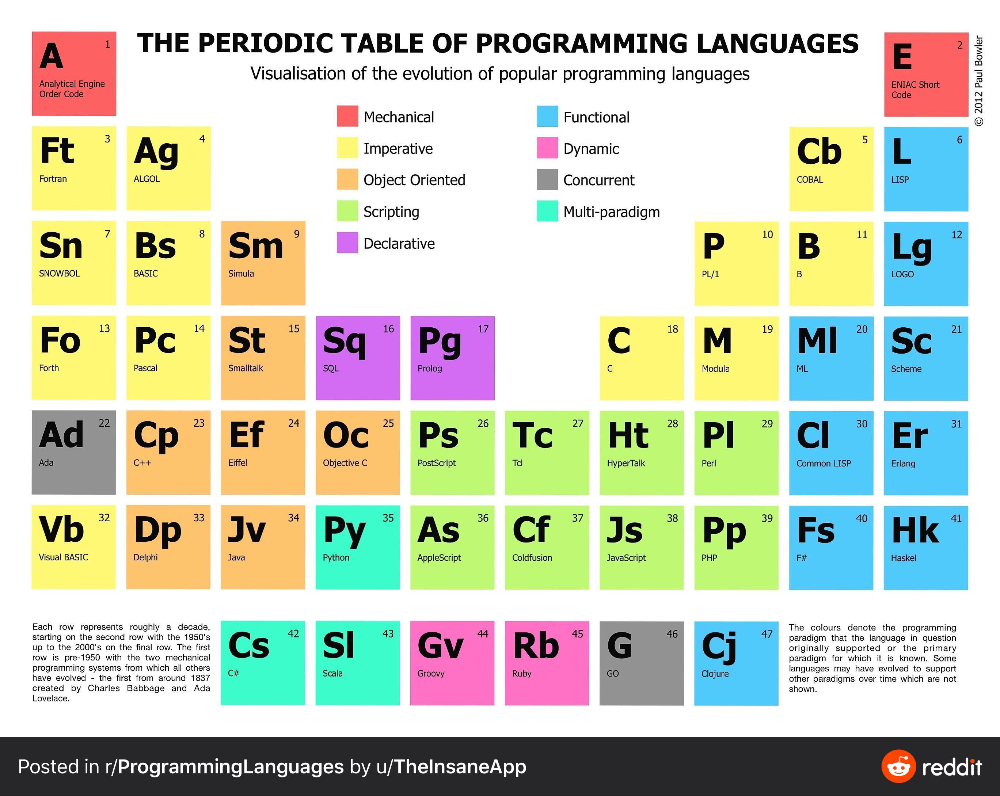

# ADVANCED PROGRAMMING LANGUAGES

[[toc]]

## METADATA

Why take this course:

- it will be fun
- you'll learn amazing programming techniques
- you'll be exposed to some of the most fascinating pieces of computer science theory

Bacically this course is to convince you that functional programming is better than imperative programming.

## EXAM

Written test. (and then a bonus project if we want, we can propose the project)

## Materials

Books:

- [Programming in scala (Odersky)](https://www.amazon.it/Programming-Scala-Fifth-Martin-Odersky/dp/0997148004)
- [Functional programming in scala (Chiusano)](https://www.amazon.it/Functional-Programming-Scala-Paul-Chiusano/dp/1617290653)

## Index

- Introduction
  - evolution of programming languages design and implementation
  - introdution to functional programming in scala
- typing foundations of progamming languages
  - untyped lambda calculus and its operational semantics
  - typing: types, type system, typ safety
- functional data and function modeling in scala
  - immutable non-encapsulated data structures in scala
  - lists and trees; firs-order higher-order and polymorphic functions
- subtyping and subtype polymorphism
  - the subtyping principle and the subtype relation
  - typing and subtyping: nominal vs structural
- object-oriented programming
  - encapsulated data types: traits, classes and hyerarchy of types
- type parametrization
  - generics, variance and type bounds
  - collections

- Ad hoc polymorphism
  - Da overloading a polimorfismo parametrico (bounded)
  - Qualified types e type classes

- Strict vs Non-strict evaluation
  - Strategie di valutazione: fondamenti e conseguenze per l'implementazione
  - Lazy evaluation al lavoro: thunks, lazy lists e strutture dati infinite

- Gestione Error handling
  - Exceptions: strenghts, weaknesses and alternatives.
  - Options e Try in Scala

- Monads and monadic programming
  - Conceptual framework
  - Applications: State, IO

- Parallel & Concurrent computation
  - Models of parallel and concurrent computation: from shared memory to actors.
  - Concurrent and asynchronous computations with Futures

## Get started with Scala in VSCode

<https://marketplace.visualstudio.com/items?itemName=scalameta.metals>
