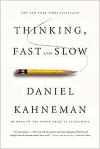
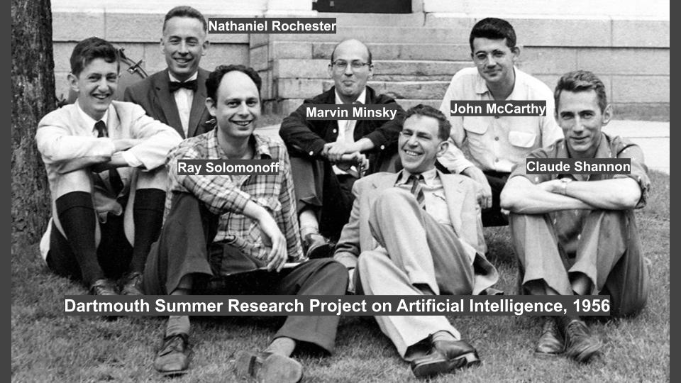

# FOUNDATIONS OF MACHINE LEARNING

## Introduction

Neural networks and and machine learning.

### What is Artificial Intelligence?

::: tip
There is no universally accepted definition.
The ability to perform well in an intelligence test ().  
Operational definition: procedure to measure intelligence.
Boring, 1961

The turing test
Does the machine acts like a human?  
Alan Turing
:::

ChatGPT cannot pass the turing test.

To pass the test the Ai needs these skills:

- Natural language processing (to interact with humans)
- Knowledge representation (to memorize things)
- Automated reasoning (to use the knowledge to answer questions)
- Machine learning (to adapt to new circumstances and detect patterns)
- Perception (Computer vision and speech recognition)
- Robotics (to manipulate objects and move around)

AI: an interdisciplinary edeavor:

Cognitive science, Neurobiology, Philosophy, Sociology, Perception & Learning, Linguitics, Robotics

> Geoffrey Hinton  
> He is the father of deep learning  
> He can solve very difficult problems with ai  

Two approaches to make a computer do what you want:

- Intelligent design (classic algorithms. i.e. Djikstra)
- Machine Learning (AI, the modern way of solving problems)

Two modes of thinking:

- System 1: Fast, conscious, automatic, everyday decisions, error prone
- System 2: Slow, unconscious, effortful, complex decisions, reliable

First successes:

- 1943 McCulloch and Pitts propose a model for an artificial neuron and analyze its properties
- 1949 Donald Hebb proposes a learning mechanims in the brain
- 1950-53 Shannon and Turing work (independently) on chess-playing programs
- 1951 Minsky and Edmonds develop the first "neural" computer
- 1952+ Samuel develops a checker playing game
- 1956 Newell e Simon develop the "Logix Theorist"
- 1957 First attempts at automatic translation (during Cold war)
- 1958 McCarthy invents LIPS (programming language)

- 1956 DARTMOUTH SUMMER RESEARCH PROJECT ON ARTIFICIAL INTELLIGENCE
  - The birth of AI (2 months in summer of research financed by the goverment)
- 1961 Newell and Simon develop General Problem Solver (GPS)
- 1963+ Minsky and students study problems on micro-worlds (es. ANALOGY SHRDLU)
- 1962 Rosenblatt develops the Perceptron, a neural net that learn from examples (classification problem: recognize male vs female). This approach was bad and died:

Failures:

- 1966 Financing to "automatic translation" is project in the USA is canceled
- 1969 Minsky and Papert publish "Perceptrons" where they show that the Rosenblatt model cannot sove some very simple problems
- 1971-72 Cook and Karp develop the computational complexity theory, showing that a lot of problems are "intractable" (NP-complete)

The expert systems are boom:

- 1969 Feigenbaum (Satnford) develop DENDRAL, an ES for making predictions on molecular structures
- MYCIN, an ES with some 450 rules for  the diagnosis of infectious diseases
- 1979 PROSPECTOR, an Expert System (ES) for mineral exploration
